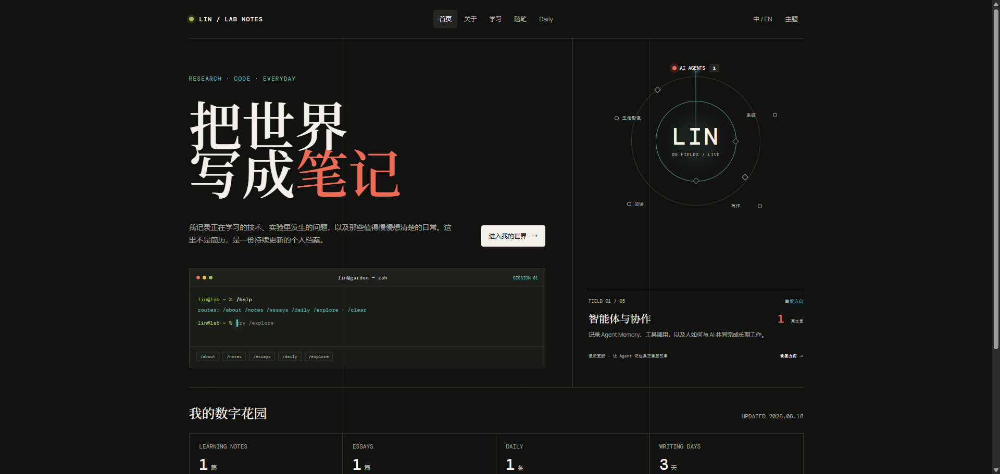

# AstroOrbitale 中文文档

<p align="center">
  
</p>

<div align="center">
  <p><strong>一个中文优先的 Astro 个人数字花园主题。</strong></p>
  <p>
    <a href="https://linyeegiong.github.io/"><strong>查看正式博客 ↗</strong></a>
    ·
    <a href="https://github.com/LinYeeGiong/AstroOrbitale#use-orbitale-as-a-template"><strong>使用模板</strong></a>
    ·
    <a href="README.md"><strong>English README</strong></a>
  </p>
  <p>
    <a href="https://github.com/LinYeeGiong/AstroOrbitale/releases"></a>
    <a href="https://github.com/LinYeeGiong/AstroOrbitale/actions/workflows/deploy.yml"></a>
    <a href="LICENSE"></a>
    <a href="https://astro.build/"></a>
  </p>
</div>

> 正式预览地址是 [Lin / Lab Notes](https://linyeegiong.github.io/)，这是运行 Orbitale 的个人博客。`AstroOrbitale` 仓库本身是可复用的主题和模板。

## ✦ 项目简介

Orbitale 是静态站点主题，不是托管式博客服务。你拥有自己的仓库、文章和部署流程。主题提供首页探索轨道、永久文章页面、可访问的交互、RSS，以及统一的个性化配置入口。

推荐把 Orbitale 作为 GitHub Template 使用，并将公开主题仓库与实际个人博客仓库分开维护。

## 🔥 功能

- 基于 Astro 7、TypeScript 和静态输出。
- 中文优先的 `notes`、`essays`、`daily` 三类内容集合。
- 永久文章页面、canonical、Open Graph、JSON-LD 和前后篇导航。
- 根据真实文章标签生成探索领域和发布数量。
- 写作热力图与标签归档。
- 支持键盘操作的命令行导航。
- 深色/浅色主题和减少动态效果支持。
- `/rss.xml` 合并摘要 RSS。
- GitHub Pages 部署工作流。
- 所有个人信息集中在 `src/config/site.ts`。
- 主题代码采用 MIT，个人内容保持作者原有版权。

## ✅ 环境要求

- Node.js `22.12.0` 或更高版本。
- npm。
- 用于 GitHub Pages 部署的公开 GitHub 仓库。

## 🚀 使用模板

1. 打开 [AstroOrbitale 仓库](https://github.com/LinYeeGiong/AstroOrbitale)。
2. 点击 **Use this template**，然后选择 **Create a new repository**。
3. 如果要使用 GitHub 用户主页，仓库命名为 `<username>.github.io`。Lin 的个人博客仓库是 `LinYeeGiong.github.io`。
4. 克隆新建的个人博客仓库并安装依赖。
5. 替换演示文章并编辑 `src/config/site.ts`。

```bash
git clone https://github.com/<username>/<username>.github.io.git
cd <username>.github.io
npm install
npm run dev
```

主题仓库与个人博客仓库分开后，可以独立审查和更新主题，不会把私人草稿或个人媒体混入公开主题。

## 💻 快速开始

```bash
npm install
npm run dev
```

打开 Astro 输出的本地地址。提交前运行完整验证：

```bash
npm run verify
```

首先修改 [`src/config/site.ts`](src/config/site.ts)。这里集中保存站点身份、网址、首页文字、导航、终端身份、探索领域和页脚链接。

## 🗂️ 项目结构

```text
.
├── public/                 # favicon、图片等静态资源
├── src/
│   ├── components/         # Header、Hero、终端、轨道和公共 UI
│   ├── config/site.ts      # 唯一的个性化入口
│   ├── content/
│   │   ├── notes/           # 学习笔记和技术记录
│   │   ├── essays/          # 长篇随笔
│   │   └── daily/           # 日常记录
│   ├── layouts/            # 站点和文章布局
│   ├── lib/                # 内容与聚合工具
│   ├── pages/               # 首页、永久页面、标签和 RSS
│   └── styles/              # 全局和组件样式
├── tests/                  # Vitest 与 Astro 渲染测试
├── .github/workflows/      # GitHub Pages 工作流
├── astro.config.mjs
├── src/content.config.ts
└── package.json
```

## ⚙️ 配置站点

不要在组件中逐个搜索个人信息，只编辑 [`src/config/site.ts`](src/config/site.ts)。

| 配置 | 作用 |
| --- | --- |
| `name`、`shortName`、`title`、`brand` | 姓名、简称、页面标题和品牌 |
| `description`、`locale`、`timezone`、`location` | 描述、语言、时区和地区 |
| `siteUrl`、`github`、`repository`、`email` | 正式网址和联系方式 |
| `hero` | 首页标题、简介和按钮 |
| `navigation` | 顶部导航 |
| `terminal` | 命令行提示符、快捷命令和欢迎文字 |
| `exploration` | 探索领域、匹配标签和目标页面 |
| `footer` | 版权文字和页脚链接 |

个人博客应使用自己的地址：

```ts
siteUrl: 'https://<username>.github.io',
github: 'https://github.com/<username>',
repository: 'https://github.com/<username>/<username>.github.io',
```

构建时可以通过 `PUBLIC_SITE_URL` 覆盖 `siteUrl`。探索轨道的数量和最新文章来自已发布内容，`exploration[].tags` 只负责定义标签归属。

## ✍️ 编写内容

Markdown 或 MDX 文件分别放在：

```text
src/content/notes/
src/content/essays/
src/content/daily/
```

三类内容共享 `title`、`description`、`date`、`tags`、`lang` 和 `published` 字段。`v0.2.1` 只为 `lang: zh` 且 `published: true` 的内容生成公开路由。

### Notes

```yaml
---
title: Agent Memory Note
description: 记录哪些信息值得保存、检索和复盘。
date: 2026-08-18
tags: [AI, Agent, Memory]
lang: zh
published: true
series: Agent Systems
readingMinutes: 12
---
```

### Essays

```yaml
---
title: 公开写作
description: 一份持续的记录比一次完成的表演更有价值。
date: 2026-08-10
tags: [写作, 思考]
lang: zh
published: true
---
```

### Daily

```yaml
---
title: 像自己的空间
description: 一个小的设计决定改变了博客的感觉。
date: 2026-08-17
tags: [Daily, 设计]
lang: zh
published: true
location: LAB
images: [/images/daily/2026-08-17/lab.jpg]
---
```

草稿使用 `published: false`。静态图片放在 `public/images/`，在 Markdown 中使用 `/images/...` 路径。仓库自带内容只是演示数据，创建个人博客后请替换。

## 🧞 常用命令

| 命令 | 作用 |
| --- | --- |
| `npm install` | 安装依赖 |
| `npm run dev` | 启动本地开发服务器 |
| `npm run check` | 执行 Astro 检查和类型检查 |
| `npm test -- --run` | 同步内容并运行 Vitest |
| `npm run build` | 生成静态生产构建 |
| `npm run verify` | 运行测试、检查和生产构建 |
| `npm run preview` | 本地预览生产构建 |

## 🚀 部署到 GitHub Pages

仓库包含 `.github/workflows/deploy.yml`：

1. 在 `src/config/site.ts` 中设置 `siteUrl` 和 `repository`。
2. 将个人博客仓库的 `main` 分支推送到 GitHub。
3. 打开仓库的 **Settings -> Pages**。
4. 将 **Source** 设置为 **GitHub Actions**。
5. 等待 `Deploy Orbitale to GitHub Pages` 工作流完成。

如果仓库命名为 `<username>.github.io`，最终地址就是 `https://<username>.github.io/`。工作流会把 Pages 的正式 origin 传给 Astro，用于 canonical 和 RSS。

## 🔄 从上游更新

在个人博客仓库中添加主题上游：

```bash
git remote add upstream https://github.com/LinYeeGiong/AstroOrbitale.git
git fetch upstream --tags
```

合并前先提交自己的文章和配置。处理 `src/config/site.ts` 与 `src/content/` 冲突时，以个人博客仓库内容为准。

## 🧭 仓库模型

| 仓库 | 用途 |
| --- | --- |
| `LinYeeGiong/AstroOrbitale` | 公开主题代码、模板默认值和版本发布 |
| `LinYeeGiong/LinYeeGiong.github.io` | 个人配置、文章、草稿和媒体 |

其他用户只需把用户名替换为自己的账号，模型保持不变。

## 📜 许可证与内容版权

Orbitale 主题代码使用 [MIT License](LICENSE)。MIT 只覆盖主题代码；文章、笔记、Daily、头像、照片和其他个人媒体仍归各自作者所有，除非另有明确授权。使用 Orbitale 不会把你的博客内容自动改成 MIT。

## 📦 发布版本

当前版本是 [`v0.2.1`](https://github.com/LinYeeGiong/AstroOrbitale/releases/tag/v0.2.1)，包含 v0.2 的内容模型、永久页面、标签归档、RSS、集中式配置、发布元数据，以及干净 checkout 下的 Astro 内容缓存修复。
